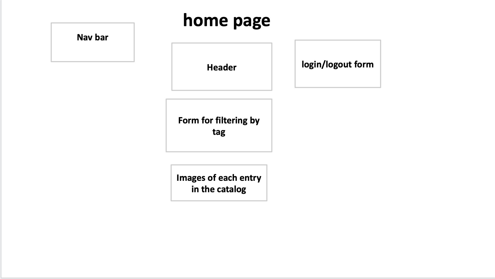
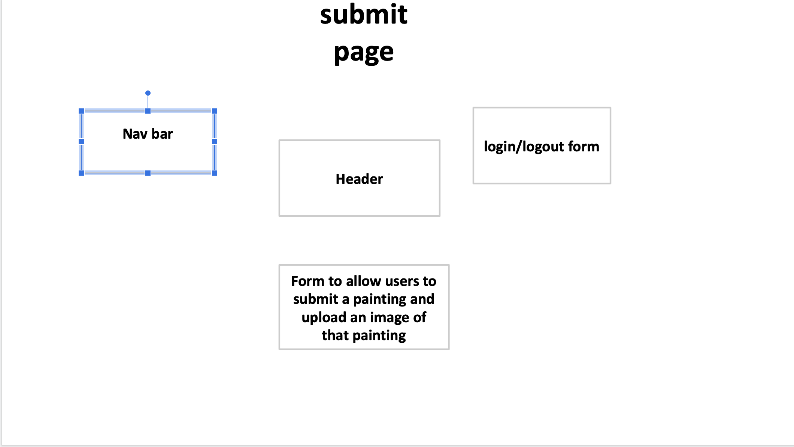

# Project 3: Design Journey

Be clear and concise in your writing. Bullets points are encouraged.

**Everything, including images, must be visible in Markdown Preview.** If it's not visible in Markdown Preview, then we won't grade it. We won't give you partial credit either. This is your warning.


## Design Plan

### Project 1 or 2
> Do you plan to reuse your Project 1 or 2 site?
> Which project?

No

> If yes, please include sketches of the site's current design (you may copy the "final" sections from those assignments.)


### Describe your Media Catalog (Milestone 1)
> What will your collection be about?
> What type of media will your site display? (images, videos, audio)

My media catalog will display the most expensive paintings ever sold. It will contain images of each painting.


### Audiences (Milestone 1)
> Briefly explain your site's audiences. Be specific and justify why each audience is appropriate for your site.
> You are required to have **two** audiences: "information consumers" and "site administrators"

Information Consumer: The site's audience would be art dealers. They would be the most likely group of people
who would visit the website and view its content, since they would be interested in learning more about large art deals and what
prices are appropriate for extremely large deals.


Site Administrator: The site administrator would be art enthusiasts. They would be likely to be interested
in the site content and updating/maintaining it. Since they are passionate about art, they wouldn't mind
sharing their passion with others and maintaining it in their free time.


### Personas (Milestone 1)
> Your personas must have a name and a "depiction". This can be a photo of a face or a drawing, etc.
> There is no required format for the persona.
> You may type out the persona below with bullet points or include an image of the persona. Just make sure it's easy to read the persona when previewing markdown.
> Your personas should focus on the goals, obstacles, and factors that influence behavior of each audience.

> Persona for your "consumer" audience:

- Nicolai, Art dealer
- Male
- middle-aged, upper middle-class
- Works for an auction house in NYC
- works on high profile deals, wants to visit the site frequently to reference past large art deals


> Persona for your "administrator" audience:

- Rachel
- Art student
- Female
- Stereotypical broke college student
- Early twenties, has more free time than other adults due to being a student
- Spends free time learning about art, maintaining a personal blog about art, and maintaining this website


### Site Design (Milestone 1)
> Document your _entire_ design process. **We want to see iteration!**
> Show us the evolution of your design from your first idea (sketch) to the final design you plan to implement (sketch).
> Show us the process you used to organize content and plan the navigation, if applicable (card sorting).
> Plan your URLs for the site.
> Provide a brief explanation _underneath_ each design artifact. Explain what the artifact is, how it meets the goals of your personas (**refer to your personas by name**).
> Clearly label the final design.


This is my card sort for the home page of my site. I believed my home page should include a nav bar to navigate to other pages of the site as well as the login/logout form because this is standard practice across professional catalog websites. I want to include in this home page images and basic information about every entry in the catalog so users can scroll through the entire catalog, which is standard practice in catalog sites like Amazon. Other features I thought were necessary for this page include forms that allow for filtering by tags and a form
that allows for new submissions.


This is my revised card sort for the home page. The major difference is that I decided to put the submit a new entry form on another page, since catalog websites like Instagram and Amazon have the submission form on another page as well; this form does not need to be in the home page.


This is my card sort for a page dedicated to one entry of the catalog. Elements I thought were necessary for this page include a large image of the painting, information about the painting, and a form that allows the users to edit the painting. I also included the nav bar and login/logout form in case the user wants to login or logout at anytime or navigate to another page. Catalog websites like Amazon and Instagram allow users to login/logout or navigate to other pages anytime they want, regardless of what page they are currently looking at.


This is my revised card sort for a painting's page. The major difference is that
I decided that it would not be appropriate to immediately show the form that edits the tags. Instead, I now have a
preliminary form that finds out what the user wants to do. If the user wants to delete an entry, they will specify so, and the entry will be delete upon submission of this preliminary form.
Then, after the submission of this form, if the user chooses to edit tags instead of deleting, another form would pop up
that allows the user to select which tags they want to add or remove. This design is used in Instagram; Instagram does not let users immediately
edit entries from a catalog with a form but gives the users a form that gives the user choices on what they can do.
Upon submission of that form, another form pops up depending on what the user has selected, and the user can then fulfill their
intended action using this second form.



This is my card sort for the page that allows users to submit a new entry. Many catalog sites like Amazon and Instagram have a
separate page dedicated to submitting new entries to the catalog. I included the header, which includes a nav bar and login/logout form
just like all the pages of my website, and I included everything necessary for entry submission, which is just a form that allows
users to input information about their submission as well as upload am image of the painting.


I based my site design off of the designs used by art investment websites, which
have simple colors and designs but are professional looking, as well as catalog websites like Amazon which showcase all the entries in the catalog
in neat, consistent rows: a common design pattern among catalog websites like Amazon and Instagram. So, my site is designed for the audience of my site, namely Nicolai, who
is an art dealer and would be most familiar with these kinds of sites. The home page would showcase
all items in the catalog, and gives Nicolai the option to filter the catalog by tag to save him time and allow him
to only see the entries he wants to see; this would be done with a select form in the top left of the page. A header that contains
the a nav bar, the title of the site, as well as username/password/logout elements appears in many pages across catalog websites like Pinterest, Instagram, and Amazon; I wanted to replicate this common catalog design pattern by having a header that contains
these elements across all pages of my website.


This is the final iteration of the design of the home page. I realized that in some catalog websites, like Amazon, there are no "submit" buttons everywhere. So, I got rid
of the button that filters the catalog by tag and instead made it so that
a change in the select element in the front page would result in filtering.
I chose a select input element because websites like Amazon have select input
elements the user could use to determine which items they want to view in the catalog. Also, I placed each image and painting title within a div, and I standardized the size of each image so that the width and height do not exceed
certain dimensions. The div holding each image and painting would be the same size. This design is used in Amazon's website. Even though the images of items in Amazon's website are of different dimensions, they all have the same width
and do not exceed a certain height. Amazon's website also places each item image and item name in a div to show create separation from other items; this gives a more clear, streamlined experience for the user.
In my past sketch, I did not care about the spacing between each painting's title and image, which resulted in inconsistent spacing between elements and entries on the page when I implemented the design. So, I had to go back and change the design to the current iteration to create more consistent spacing and to make the design look cleaner. I also placed the log in button
on the same level as the username and password text inputs, because this is
design that shows up in catalog websites such as Amazon.


Upon clicking a painting in the catalog, Nicolai will be directed to a page dedicated solely to that painting.
This page contains all the information about the painting, and has an enlarged image of the painting.
This page allows Rachel to edit details about the painting or delete it from the catalog, and only administrators
like Rachel are allows to edit details. Editing the painting involves choosing an action from a select form, which could
lead to another form for Rachel to fill out.
There is a nav bar on all pages that allows users to navigate back to the home page
or to the submission page. Next to the nav bar, there is a login form that administrators like Rachel could
use to login. I included the header in this page as well because in many catalog sites such as Instagram and Amazon, headers containing the title of the website are repeated across all pages of the site; this is why I chose to make the header a PHP partial.


This is the final iteration of the design for painting.php, which shows a painting
and details about the painting. This page was made because in many catalog websites like Amazon and Instagram, the the user could click on an item in the
catalog to go to a page dedicated to that item; this page would contain information
about that item. I noticed that some catalog websites have mini-images that
represent tags, so I included images of tags to represent the tags. I also included
a select form, without a submit button since the button is unnecessary, which
allows the user to choose to edit the tags of the painting, and if the user is
an admin, to delete the item from the catalog. In this iteration, I set the select form's default value as "..."
because the symbol "..." seems to be universally understood as giving the user multiple options to
edit the entry. This symbol is a common design pattern among catalog sites such as Instagram. If the user selects delete, the
item would be removed from the catalog. If the user selects "Edit Tags",
it would pull up another form, which is shown in the bottom of the sketch. This
form contains checkboxes that the user could select or unselect to indicate which tags should be added or removed from the item. It also has a text input that
the user could use to add a new tag to this item.
I used checkboxes because catalog websites like Amazon frequently use checkboxes
when interacting with the user. Form elements are grouped together in one part of the page, which is a common design pattern in catalog websites like Instagram; this is an improvement over the previous sketch.


This page allows Rachel, an administrator, to make a submission. It would only be available to users who login
successfully. This page includes a form that allows Rachel to fill in info about her submission and upload an image
of the painting to be added to the catalog.


I further expanded on the page once I realized all the things I would have to implement in the submission form. Like I designed in other pages of the website,
I use checkboxes to allow the user to add tags, which maintains consistent design across pages. The form is a white div in the center of the screen, which is similar
to the white div in the painting.php design, which is also in the center of the screen
and contains all the important elements in the page.


This is the sketch for the 404 not found page. The helpful error message is placed
in a white div in the middle of the page, which is in line with the design of the
other pages.
Catalog websites like Instagram use pages similar to a 404 page to let users
know that the item that are trying to view has been deleted from the catalog, which
is why I used this page not only for incorrect links, but also for when users
delete items from the catalog.

### Design Patterns (Milestone 1)
> Write a one paragraph reflection explaining how you used the design patterns in your site's design.

 In the main page, I showcase the entire catalog for users to see.
I have a dropdown that allows users to filter the catalog by tag, which is
similar to what professional catalog websites offer, and was explicitly mentioned in lab when discussing common catalog design patterns. The example catalog websites in lab use the select element to allow users to change what data
is being displayed. Upon clicking each of
the items in the catalog, it directs the user to a page dedicated solely to
that item, which is what professional catalog websites such as Amazon and Instagram do. There, the user
could view details about the item, and if they are an administrator, they could
delete or edit the item in the catalog. Administrators could also upload new
items to the catalog to update it by clicking a link on the nav bar.
Catalog websites (not apps) like Amazon and Instagram do not allow users
to add new items to the catalog from the home screen; there is a separate link
to that page, and this is a design pattern I wanted to follow.
There is a login form on the top right of the home page, which is in line
with what many catalog websites have.


## Implementation Plan

### Requests (Milestone 1. Revise in Milestone 2)
> Identify and plan each request you will support in your design.
> List each request that you will need (e.g. view image details, view gallery, edit book, tag product, etc.)
> For each request, specify the request type (GET or POST), how you will initiate the request: (form or query string URL), and the HTTP parameters necessary for the request.

Example:
- Request: view movie details
  - Type: GET
  - URL: /movie/details?id=X
  - Params: id _or_ movie_id (movies.id in DB)

- Request: view gallery
  - Type: GET
  - URL: /home/gallery
  - Params: image_link

- Request: get all abstract paintings
  -Type: GET
  - URL: /home/gallery?id=abstract
  - Params: image_link, page_link


### Database Schema (Milestone 1. Revise in Milestone 2)
> Describe the structure of your database. You may use words or a picture. A bulleted list is probably the simplest way to do this. Make sure you include constraints for each field.

> Hint: You probably need a table for "entries", `tags`, `"entry"_tags` (stores relationship between entries and tags), and a `users` tables.

> Hint: For foreign keys, use the singular name of the table + _id. For example: `image_id` and `tag_id` for the `image_tags` (tags for each image) table.


CREATE TABLE art (
  id INTEGER NOT NULL PRIMARY KEY AUTOINCREMENT UNIQUE,
  user_id TEXT NOT NULL,
  title TEXT NOT NULL UNIQUE,
  artist TEXT NOT NULL,
  buyer TEXT NOT NULL,
  seller TEXT NOT NULL,
  created_date INTEGER NOT NULL,
  sale_date TEXT NOT NULL,
  price REAL NOT NULL,
  file_name TEXT NOT NULL UNIQUE,
  file_ext TEXT NOT NULL,
  FOREIGN KEY(user_id) REFERENCES users(id)
);


CREATE TABLE tags (
  id INTEGER NOT NULL PRIMARY KEY AUTOINCREMENT UNIQUE,
  tag_name TEXT NOT NULL UNIQUE
);

CREATE TABLE art_tags (
  id INTEGER NOT NULL PRIMARY KEY AUTOINCREMENT UNIQUE,
  tag_id INTEGER NOT NULL,
  art_id INTEGER NOT NULL,
  FOREIGN KEY (tag_id) REFERENCES tags(id),
  FOREIGN KEY (art_id) REFERENCES art(id)
);

CREATE TABLE users (
	id INTEGER NOT NULL PRIMARY KEY AUTOINCREMENT UNIQUE,
	name TEXT NOT NULL,
	uname TEXT NOT NULL UNIQUE,
	pword TEXT NOT NULL
);


CREATE TABLE sessions (
	id INTEGER NOT NULL PRIMARY KEY AUTOINCREMENT UNIQUE,
	user_id INTEGER NOT NULL,
	session TEXT NOT NULL UNIQUE,
  last_login  TEXT NOT NULL,

  FOREIGN KEY(user_id) REFERENCES users(id)
);

CREATE TABLE groups (
	id INTEGER NOT NULL PRIMARY KEY AUTOINCREMENT UNIQUE,
	group_name TEXT NOT NULL UNIQUE
);

CREATE TABLE memberships (
	id INTEGER NOT NULL PRIMARY KEY AUTOINCREMENT UNIQUE,
  group_id INTEGER NOT NULL,
  user_id INTEGER NOT NULL,

  FOREIGN KEY(group_id) REFERENCES groups(id),
  FOREIGN KEY(user_id) REFERENCES users(id)
);


### Database Query Plan (Milestone 1. Revise in Milestone 2)
> Plan your database queries. You may use natural language, pseudocode, or SQL.

Get records with the tag 'realist':
"SELECT * FROM art INNER JOIN tags ON art.title = tags.tag_name WHERE tags.id= 1;"

Get records with the tag 'modern':
"SELECT * FROM art INNER JOIN tags ON art.title = tags.tag_name WHERE tags.id= 2;"

Get all tags associated with current page:
"SELECT * FROM tags INNER JOIN art_tags ON tags.id = art_tags.tag_id WHERE :id = art_tags.art_id",

Remove specific tag associated with current page:
"DELETE FROM art_tags WHERE tag_id = :tag_id AND art_id = :art_id"

Delete entry from catalog:
"DELETE FROM art WHERE id = :id"

Delete tags associated with entry
"DELETE FROM art_tags WHERE art_id = :id"


### Code Planning (Milestone 1. Revise in Milestone 2)
> Plan any PHP code you'll need here using pseudocode.
> Use this space to plan out your form validation and assembling the SQL queries, etc.
> Tip: Break this up by pages. It makes it easier to plan.

home.php
```
If select form is submitted:
  If chosen selection is 'realist':
    query and show records with tag 'realist'
  if chosen selection is 'modern':
    query and show records with tag 'modern'
  if chosen selection is 'abstract':
    query and show records with tag 'abstract'
```

painting.php:
```
if edit form is submitted:
  if edit form value is 'delete':
    delete painting from databases
  else:
    if new tag:
      add new tag to database
    else:
      add selected checkbox tags to painting in database
      delete unselected checkbox tags from painting in database
```
submit.php:
```
if form is submitted:
  validate form
  if form is validated:
    submit to art table in database
    submit to tags table in database
  else:
    show form feedback
```

## Submission

### Audience (Final Submission)
> Tell us how your final site meets the needs of the audiences. Be specific here. Tell us how you tailored your design, content, etc. to make your website usable for your personas. Refer to the personas by name.

The website allows Nicolai to view the most expensive paintings ever sold all at once in the home page. Upon clicking one of the paintings, Nicolai is brought to another page where he could then learn more details about the painting such as its price, buyer, and seller The same page also allows Nicolai to make
edits to the tags associated with the painting, in case he spots an error. This ability is given to Nicolai because he is experienced in the art industry and it would not be improbable for him to be able to spot mistakes; this allows him to make corrections that Rachel must have missed, since Rachel does not have his expertise on the art industry. However, only Rachel can add new paintings or remove paintings. This is intended for ethical reasons; there might be a conflict of interest with Nicolai and editing the website. Nicolai might make edits for monetary gain, such as increasing the paintings' sell prices, so that he may get bigger deals. To implement this, the design was made so that only Rachel has access to the "Submit an Entry" link in the nav bar, and the "Delete" option in the select input element in painting.php is only available to Rachel. To log in as Nicolai, a non-admin user, the username is "michael2" and the password is "monkey"; Nicolai could only edit tags and the link to the entry submission page does not show up for him in the nav bar.


### Additional Design Justifications (Final Submission)
> If you feel like you haven’t fully explained your design choices in the final submission, or you want to explain some functions in your site (e.g., if you feel like you make a special design choice which might not meet the final requirement), you can use the additional design justifications to justify your design choices. Remember, this is place for you to justify your design choices which you haven’t covered in the design journey. You don’t need to fill out this section if you think all design choices have been well explained in the design journey.

I used a background image of an art exhibition because it went with the theme of the website. It would especially appeal to
Nicolai, since as an art dealer he probably visits similar exhibitions. The background image has low opacity to allow enough
contrast between the image and the paintings on the website and to not be too distracting. I used common design practices for forms like having the elements flow from top to the bottom right, the natural progression of the eye, and having adequate spacing between elements and sizing of elements.


### Self-Reflection (Final Submission)
> Reflect on what you learned during this assignment. How have you improved from Project 1? What things did you have trouble with?

I was able to combine everything I learned from Project 1 and 2. I was able to create a dynamic website using PHP partials to factor out repeated code, and incorporating a SQLite database to store information. I employed much more extensive and complicated SQL queries during this project, and I used new SQL features such as "FOREIGN KEY". I also followed the design of professional, successful websites to create an appealing and effective design, which is something I did not do in Project 1. I also employed more advanced PHP code and functions than in Project 1.


### Grading: Mobile or Desktop (Final Submission)
> When we grade your final site, should we grade this with a mobile screen size or a desktop screen size?

Desktop


### Grading: Step-by-Step Instructions (Final Submission)
> Write step-by-step instructions for the graders.
> The project if very hard to grade if we don't understand how your site works.
> For example, you must login before you can delete.
> For each set of instructions, assume the grader is starting from /

Viewing all entries:
1. Make sure you are on /home
2. Scroll down to see all the entries

View all entries for a tag:
1. Near the top left, find the select input element that says "Select a tag"
2. Select a tag name (e.g. "Modern", "Abstract") to view all entries for that tag only

View a single entry and all the tags for that entry:
1. On the home page, click on either the image of the entry or the title of the entry
2. Scroll down to see all the info and tags of that entry

How to insert and upload a new entry:
1. Log in using username 'michael' and password 'monkey' to become logged in as an admin
2. Click on the "Submit An Entry" link in the nav bar in the top left
3. Fill in the form and click "Submit Painting"

How to delete an entry:
1. Log in using username 'michael' and password 'monkey' to become logged in as an admin
2. Click on either the image or title of the entry you want to delete
3. Scroll down to the select input element and select 'Delete'
4. Click on the home link in the nav bar

How to view all tags at once:
1. Near the top left, find the select input element that says "Select a tag". This should contain all the tags in the catalog

How to add a tag to an existing entry:
1. Navigate to the page dedicated to the entry you want to add a tag to
2. Scroll down to the select input element on the bottom of the page and select 'Edit tags'
3. Once the page reloads, scroll down to the new form that appears at the very bottom of the page
4. Select the checkbox that has the tag you want to add if the tag is among the current available tags and submit the form
5. If it is a new tag that is not in the catalog, type the name of the tag into the text input in the form and submit the form

How to remove a tag from an existing entry:
1. Navigate to the page dedicated to the entry you want to add a tag to
2. Scroll down to the select input element on the bottom of the page and select 'Edit tags'
3. Once the page reloads, scroll down to the new form that appears at the very bottom of the page
4. Unselect the checkbox that has the tag you want to remove (it should be automatically checked if the tag is assigned to that entry)
5. Submit the form.
